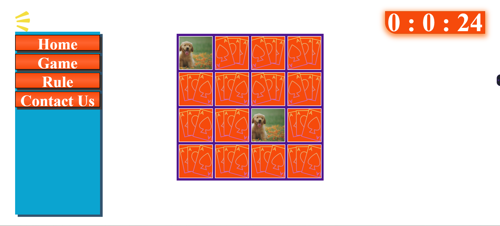

# Memory Matching Game

## Project Overview

A web-based memory card game featuring a 4x4 grid with 16 cards containing 8 matching pairs. Built using Node.js, Express.js, and Pug templates, the application tracks completion time and provides an interactive gaming experience with server-side rendering and client-side functionality.

## Project Structure

```
memory-matching-game/
├── game.js                    # Express application entry point
├── package.json             # Dependencies and scripts
├── views/
│   ├── index.pug          # Base template
│   └── game.pug            # Game interface
├── static/
│   │   └── style.css       # Game styling
│   │   └── font.ttf        # Game font        
│   └── images
```

## Technical Details

**Technology Stack:**
- **Backend**: Node.js, Express.js, Pug templating
- **Frontend**: HTML5, CSS3, JavaScript ES6+
- **Architecture**: MVC pattern with server-side rendering

**Core Features:**
- 4x4 card grid with randomized shuffle algorithm
- Real-time timer using `performance.now()` API
- State management for card matching logic
- Responsive design with CSS Grid layout
- Touch-friendly mobile interface

## Data Flow Model


### Data Flow Components

**Server-Side Processing:**
- Express Router → Route Handler → Controller → Pug Template → HTML Response

**Client-Side Game Logic:**
- User Click → Event Handler → State Manager → Match Validation → UI Update

**Game State Management:**
- Card States: Hidden, Flipped, Matched
- Timer States: Stopped, Running, Completed
- Game States: Initial, Playing, Won

## User Interface



## How to Use and Play

### Installation
```bash
git clone https://gitingest.com/chiragbansal511/Block-game
cd Block-game
npm install
npm start
```
Access at `http://localhost:8080`

### Gameplay
1. Click any card to start (timer begins)
2. Click second card to match pairs
3. Matched pairs stay visible, mismatched flip back
4. Complete all 8 pairs to win

### Controls & Features
- **Controls**: Mouse/tap to select, keyboard navigation
- **Features**: Real-time timer, flip animations, responsive design, auto win detection